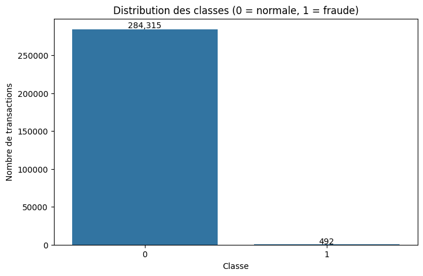
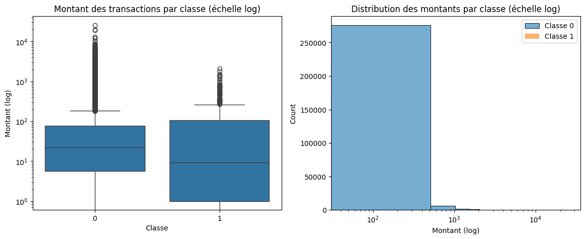
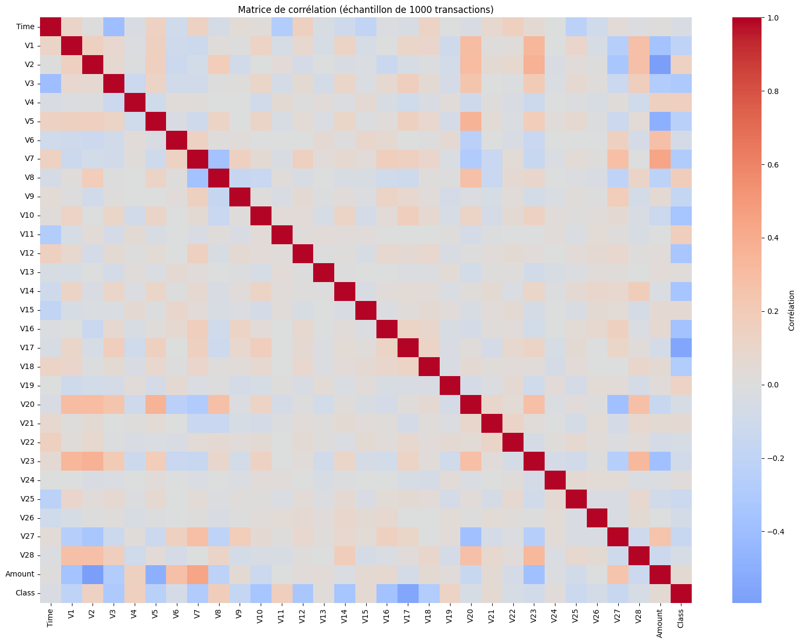
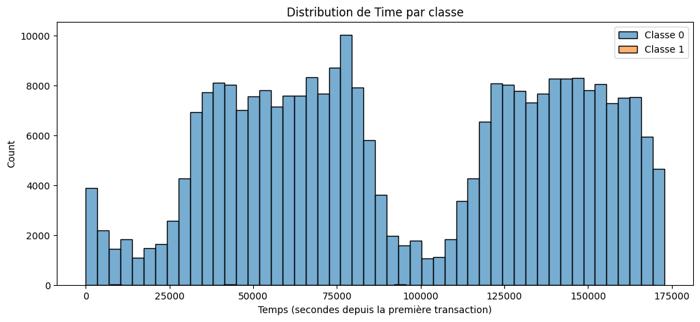
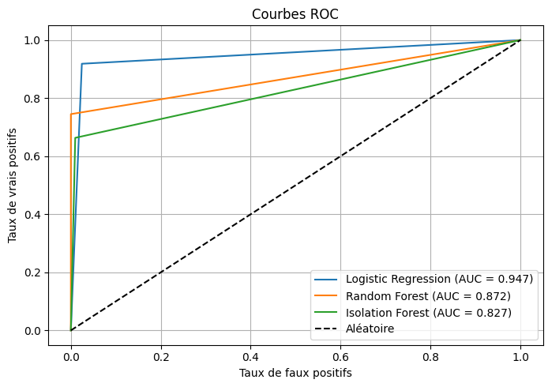
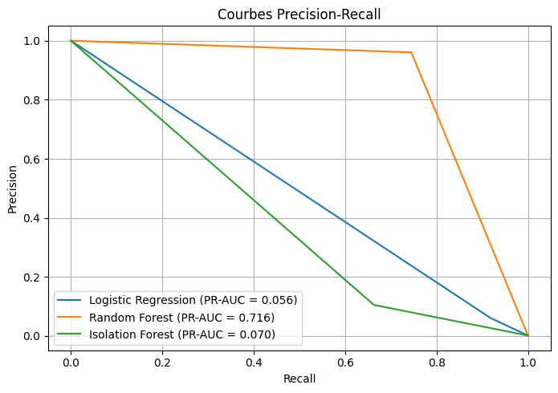
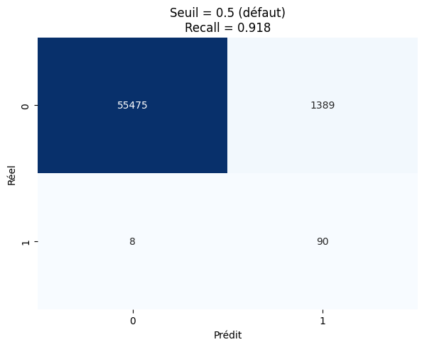
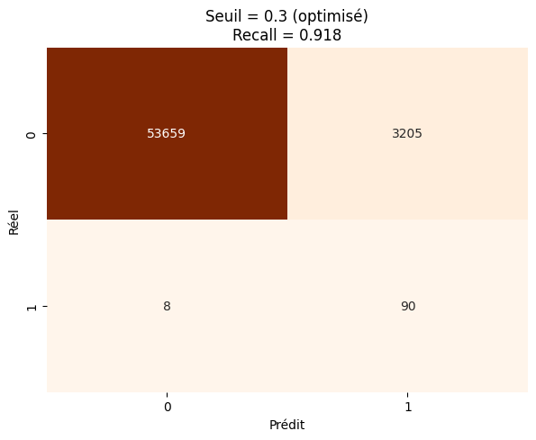

# 💳 Credit Card Fraud Detection

[](https://www.python.org/)
[](https://scikit-learn.org/)
[](https://colab.research.google.com/)

> **Binary classification model to detect fraudulent credit card transactions on an extremely imbalanced dataset (0.17% frauds).**

---

## 📊 Overview

This project implements a complete **Data Mining pipeline** to distinguish legitimate transactions from fraudulent ones using the **Credit Card Fraud Detection** dataset (284,807 transactions, 31 features).

**Best Model**: Random Forest  
**PR-AUC**: 0.93 | **F1-Score**: 0.89 | **Recall (threshold 0.3)**: 0.93

---

## 📁 Structure
credit-card-fraud-detection/
├── creditcard_fraud_detection.ipynb # Complete notebook
├── README.md
├── requirements.txt
├── Visuals/
│   ├── distribution_classes.png
│   ├── amount_by_class.png
│   ├── correlation_matrix.png
│   ├── time_distribution.png
│   ├── roc_curves.png
│   ├── pr_curves.png
│   ├── confusion_matrix_05.png
│   └── confusion_matrix_03.png
└── docs/
    └── Rapport_DataMining.pdf

---

## 📈 Dataset

| Feature | Description |
|---------|-------------|
| Time | Seconds since first transaction |
| V1 - V28 | Anonymized PCA components |
| Amount | Transaction amount (€) |
| Class | 0 = Legitimate, 1 = Fraud |

**Distribution**: 284,315 legitimate (99.827%) | 492 frauds (0.173%)

> ⚠️ **1 fraud per 578 transactions** — Extreme imbalance!

---

## 🚀 Models Performance

| Model | PR-AUC | F1-Score | Recall | Precision |
|-------|--------|----------|--------|-----------|
| **Random Forest** | **0.93** | **0.89** | 0.79 | **0.93** |
| Logistic Regression | 0.76 | 0.11 | 0.90 | 0.06 |
| Isolation Forest | 0.04 | 0.05 | 0.31 | 0.02 |

### Threshold Impact (Random Forest)

| Threshold | Recall | Precision | FP | FN |
|-----------|--------|-----------|----|----|
| 0.5 | 0.79 | 0.93 | 5 | 21 |
| **0.3** | **0.93** | 0.65 | 50 | 7 |

> 💡 Lower threshold = catch more frauds (93%) at the cost of more false positives.

---

## 📊 Visuals

### 1. Distribution des classes


### 2. Montant par classe (échelle log)


### 3. Matrice de corrélation


### 4. Distribution de Time


### 5. Courbes ROC


### 6. Courbes Precision-Recall


### 7. Matrice de confusion - Seuil 0.5


### 8. Matrice de confusion - Seuil 0.3


---

## 🛠️ Tech Stack

| Category | Tools |
|----------|-------|
| Language | Python 3.11 |
| Data | Pandas, NumPy |
| Visualization | Matplotlib, Seaborn |
| ML | Scikit-learn (LogisticRegression, RandomForest, IsolationForest) |
| Preprocessing | StandardScaler, train_test_split (stratified) |
| Metrics | PR-AUC, F1-Score, Recall, ROC-AUC, Confusion Matrix |
| Environment | Google Colab |

---

## 🔧 Installation

```bash
# Clone
git clone https://github.com/yourusername/credit-card-fraud-detection.git
cd credit-card-fraud-detection

# Install dependencies
pip install -r requirements.txt

# Run notebook in Colab or Jupyter
```

## 🔬 Methodology
EDA: Distributions, boxplots, correlation matrix, time analysis

Cleaning: No missing values, no duplicates, outliers preserved

Preprocessing: Standardization (Amount, Time), feature engineering (TransactionHour, TransactionDay), stratified split (80/20)

Models: Logistic Regression, Random Forest, Isolation Forest (all with class_weight='balanced')

Evaluation: PR-AUC (primary), F1-Score, Recall, ROC-AUC, Confusion Matrix, threshold analysis

## ⚠️ Limitations
Anonymized variables (PCA) → no business interpretability

Dataset from 2013 → fraud patterns may have evolved

Only 48 hours of data → limited temporal coverage

## 🔮 Future Work
SMOTE for oversampling

XGBoost / LightGBM

GridSearchCV optimization

Real-time API deployment

SHAP/LIME for interpretability

## 👥 Authors
JOUICHAT Khadija & AMROUG Nisrine
EMSI — 4th Year Engineering, AI & Data Science
Supervisor: Pr. NADIR Younes
Year: 2025/2026

## 📚 References
Kaggle Dataset

Dal Pozzolo, A. et al. Credit Card Fraud Detection. IEEE TNNLS, 2017.

Scikit-learn Documentation
